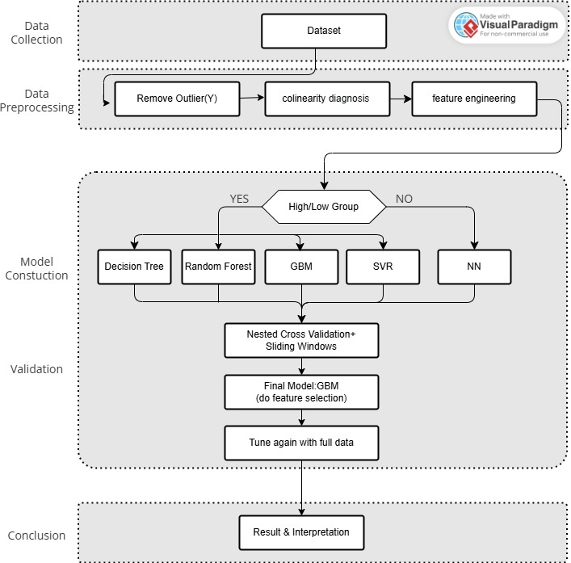

# CMP 製程效能預測與健康狀態分析

本專案使用 **PHM Data Challenge 2016** 的化學機械研磨（Chemical Mechanical Planarization, CMP）資料，根據製程時間序列感測訊號，預測晶圓的平均材料去除率 `AVG_REMOVAL_RATE`。分析流程涵蓋資料品質檢查、探索性分析、物理導向特徵工程、分組建模、時間序列交叉驗證、模型比較，以及設備與耗材健康狀態的管理建議。

主要分析內容位於 [`notebooks/MDSHW2_PART2.ipynb`](notebooks/MDSHW2_PART2.ipynb)。



## 專案目標

- 預測 CMP 製程的平均材料去除率（Average Removal Rate）。
- 從壓力、轉速、研磨液流量及耗材使用量等訊號建立具物理意義的特徵。
- 比較 Decision Tree、Random Forest、XGBoost、SVR 與 MLP 神經網路的預測表現。
- 找出影響去除率的重要因子，作為預測性保養與製程控制依據。

## 分析流程

1. **資料載入與摘要**：統計晶圓數量、變數數量、Stage／Chamber 分布及目標值分布。
2. **資料清理**：
   - 以 `WAFER_ID` 與 `STAGE` 去除重複標籤。
   - 排除 `AVG_REMOVAL_RATE <= 10` 或 `>= 300` 的極端量測值。
   - 移除無變異或完全共線欄位，例如 `MACHINE_ID` 與 `MACHINE_DATA`。
   - 依機台路徑造成的缺失特徵以 0 填補。
3. **探索性分析**：檢查壓力、流量、耗材與轉速變數的時間趨勢、共線性，以及各特徵和目標值的相關性。
4. **特徵工程**：
   - 根據壓力與旋轉狀態計算研磨、浸泡、閒置及空轉時間。
   - 對耗材使用量進行 Min-Max 縮放並取最大值。
   - 萃取壓力與轉速的非零平均數／中位數及標準差。
   - 加總各條研磨液管線流量。
   - 計算注水狀態的平均比例。
   - 依 Chamber 聚合特徵，以保留製程參數與機台的交互作用。
5. **模型訓練**：依 Chamber 將資料劃分為高速與低速組，透過 Bayesian Search 與 Nested Time-Series Cross-Validation 搜尋超參數。
6. **模型解釋與決策建議**：使用樹模型特徵重要度進行解釋，並以累積重要度 80% 篩選 XGBoost 關鍵特徵重新訓練。

## 模型結果

Notebook 中記錄的 Validation MSE 如下（數值越低越好）：

| 模型 | Validation MSE |
|---|---:|
| Optimized XGBoost（特徵篩選後） | **9.19** |
| Random Forest（分組） | 10.15 |
| Decision Tree（分組） | 16.12 |
| SVR（分組） | 19.55 |
| Neural Network（不分組） | 24.40 |

XGBoost 在本次實驗中的驗證誤差最低。分組後的神經網路因各組訓練樣本較少而表現不佳；改用完整資料訓練後有所改善，但仍未超越樹模型。

> 上表為 notebook 內手動整理的實驗值。重新執行時，結果可能因資料版本、套件版本與執行環境而略有差異。

## 主要發現

- `USAGE_OF_DRESSER_TABLE`（鑽石碟／修整器耗用狀態）是重要預測特徵；其老化可能降低拋光墊修整能力，使材料去除率下降。
- Slurry（研磨液）流量同樣具有高度影響力。流量不足可能造成去除率不足或刮傷，過高則可能降低研磨效率並浪費化學品。
- 建議將耗材健康度與研磨液穩定度整合為 FDC 複合指標，用於預測性保養、閉環流量控制及異常聯鎖。

## 環境需求

建議使用 Python 3.9 以上版本。安裝所需套件：

```bash
pip install jupyter pandas numpy matplotlib seaborn scikit-learn scikit-optimize xgboost
```

## 執行方式

1. 將 PHM Data Challenge 2016 CMP 原始資料依下列位置放置（本專案目前已完成此配置）：

   ```text
   data/raw/
   ├── training/       # 185 個 training 時間序列 CSV（672,744 筆紀錄）
   ├── test/           # 185 個 test 時間序列 CSV
   └── labels/
       ├── CMP-training-removalrate.csv
       └── CMP-test-removalrate.csv
   ```

   原始資料已由 `.gitignore` 排除，不會意外推送大型資料或競賽資料至 GitHub；其他使用者需自行取得資料後放入相同目錄。
2. 開啟 [`notebooks/MDSHW2_PART2.ipynb`](notebooks/MDSHW2_PART2.ipynb)。
3. 由上至下依序執行所有 Cell。Notebook 會自動解析 repository 根目錄，不需修改本機絕對路徑。模型採用多層時間序列交叉驗證與 Bayesian Search，完整訓練可能需要較長時間。

### 模組化資料流程

Notebook 中的資料流程亦已拆分為可獨立執行與引用的 Python 模組。所有路徑皆由命令列傳入：

```bash
# 1. 資料載入與摘要
python -m src.data.make_dataset --data-dir "<training 資料夾>" --labels "<label.csv>"

# 2. 資料清理
python -m src.preprocess.clean_data --data-dir "<training 資料夾>" --labels "<label.csv>"

# 3. 探索性分析（圖表預設輸出至 outputs/eda）
python -m src.visualization.visualize --data-dir "<training 資料夾>" --labels "<label.csv>"

# 4. 特徵工程
python -m src.preprocess.build_features --data-dir "<training 資料夾>" --labels "<label.csv>" --output data/processed/cmp_features.csv
```

各模組均提供可引用函數，例如：

```python
from src.data.make_dataset import load_sensor_data
from src.preprocess.build_features import build_features

sensor_df = load_sensor_data("path/to/training")
feature_df, fitted_scalers = build_features(sensor_df, labels)
```

使用測試資料時，應將訓練階段取得的 `fitted_scalers` 傳入 `build_features(..., fit_scalers=False, scalers=fitted_scalers)`，避免資料洩漏。

若只需個別執行模型程式，可從專案根目錄執行：

```bash
python src/model/decision_tree.py
python src/model/random_forest.py
python src/model/xgboost_model.py
python src/model/svr.py
python src/model/neural_network.py
```

## 專案檔案

```text
├── README.md
├── Makefile
├── config.yml
├── requirements.txt
├── LICENSE
├── data/
│   ├── raw/               # 原始且不可變更的資料
│   ├── interim/           # 中間轉換資料
│   └── processed/         # 模型使用的最終資料
├── docs/                  # 資料與模型文件
├── models/                # 訓練完成的模型
├── notebooks/             # Jupyter 分析與實驗
├── reports/figures/       # 報告與 EDA 圖表
├── results/               # 模型指標與預測結果
└── src/
    ├── data/              # 資料載入
    ├── preprocess/        # 清理與特徵工程
    ├── model/             # 模型訓練
    ├── evaluate/          # 模型評估
    ├── visualization/     # 視覺化
    └── common/            # 共用工具
```

| 檔案 | 說明 |
|---|---|
| `notebooks/MDSHW2_PART2.ipynb` | 完整分析、視覺化、建模與結論 |
| `src/data/make_dataset.py` | 可重用的資料載入、欄位驗證與摘要模組 |
| `src/preprocess/clean_data.py` | 標籤去重、異常值清理與冗餘欄位診斷 |
| `src/preprocess/build_features.py` | 物理特徵萃取、Chamber 聚合與資料集輸出 |
| `src/visualization/visualize.py` | 時間趨勢、共線性與目標相關性分析 |
| `src/model/` | 決策樹、隨機森林、XGBoost、SVR 與 MLP 模型 |
| `data/interim/` | 中間特徵資料 |
| `data/processed/` | 可供模型使用的最終資料集 |

## 注意事項

- Notebook 與命令列工具皆使用 repository 內的相對路徑；請維持上述 `data/raw/` 結構。
- 部分獨立 `.py` 檔案的中文註解可能存在編碼顯示問題；完整且可讀的分析說明以 notebook 為準。
- 模型驗證採時間順序切分，不應改用隨機切分，以免未來資料洩漏至訓練階段。
- 若要重現表格中的比較結果，請使用相同資料清理條件、特徵版本與 `random_state=42`。
